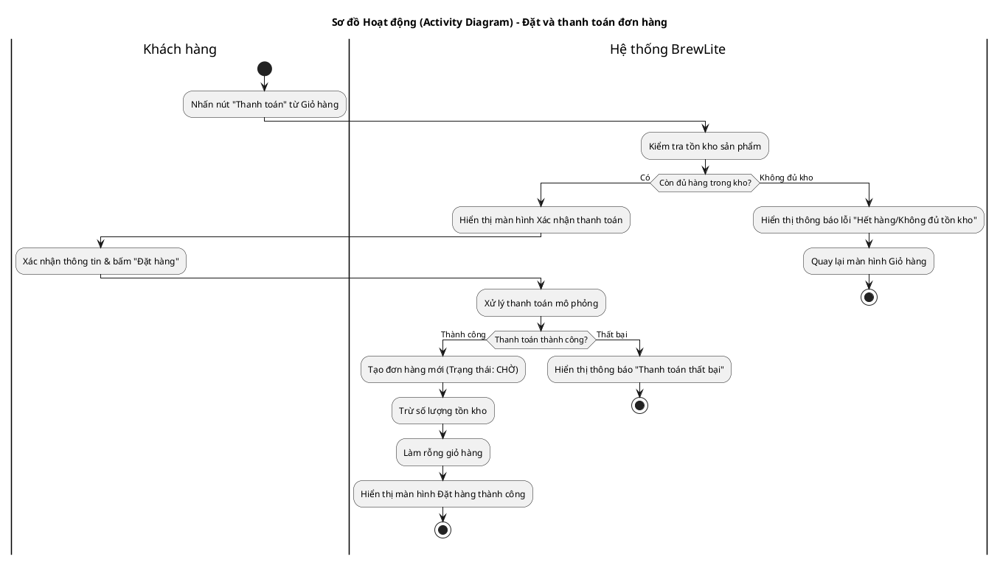

```plantuml
@startuml
title Sơ đồ Hoạt động (Activity Diagram) - Đặt và thanh toán đơn hàng

|Khách hàng|
start
:Nhấn nút "Thanh toán" từ Giỏ hàng;

|Hệ thống BrewLite|
:Kiểm tra tồn kho sản phẩm;
if (Còn đủ hàng trong kho?) then (Có)
  :Hiển thị màn hình Xác nhận thanh toán;
  
  |Khách hàng|
  :Xác nhận thông tin & bấm "Đặt hàng";
  
  |Hệ thống BrewLite|
  :Xử lý thanh toán mô phỏng;
  if (Thanh toán thành công?) then (Thành công)
    :Tạo đơn hàng mới (Trạng thái: CHỜ);
    :Trừ số lượng tồn kho;
    :Làm rỗng giỏ hàng;
    :Hiển thị màn hình Đặt hàng thành công;
    stop
  else (Thất bại)
    :Hiển thị thông báo "Thanh toán thất bại";
    stop
  endif

else (Không đủ kho)
  :Hiển thị thông báo lỗi "Hết hàng/Không đủ tồn kho";
  :Quay lại màn hình Giỏ hàng;
  stop
endif
@enduml
```