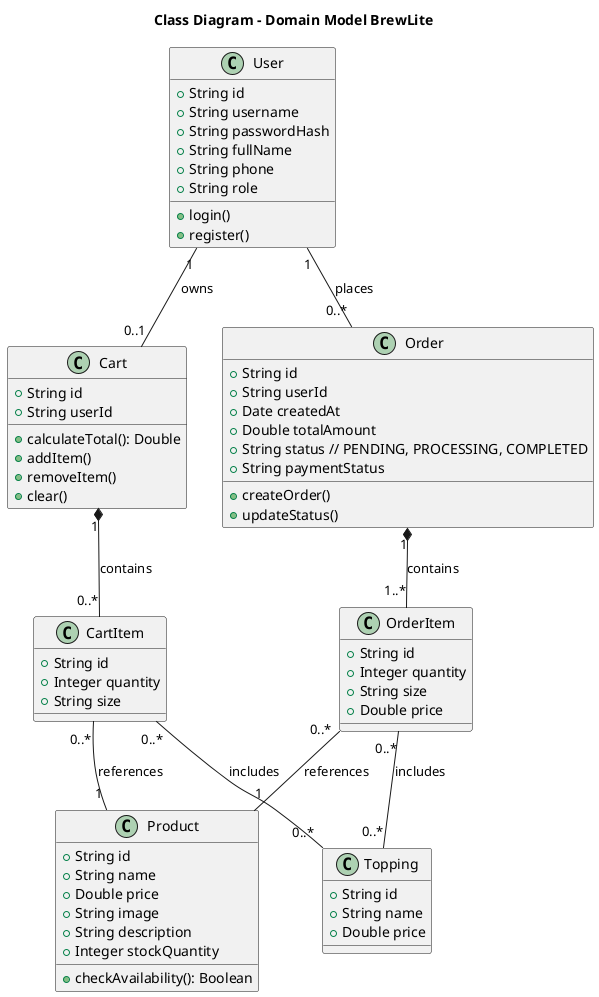

```plantuml
@startuml
title Class Diagram - Domain Model BrewLite

class User {
  + String id
  + String username
  + String passwordHash
  + String fullName
  + String phone
  + String role
  + login()
  + register()
}

class Product {
  + String id
  + String name
  + Double price
  + String image
  + String description
  + Integer stockQuantity
  + checkAvailability(): Boolean
}

class Topping {
  + String id
  + String name
  + Double price
}

class Cart {
  + String id
  + String userId
  + calculateTotal(): Double
  + addItem()
  + removeItem()
  + clear()
}

class CartItem {
  + String id
  + Integer quantity
  + String size
}

class Order {
  + String id
  + String userId
  + Date createdAt
  + Double totalAmount
  + String status // PENDING, PROCESSING, COMPLETED
  + String paymentStatus
  + createOrder()
  + updateStatus()
}

class OrderItem {
  + String id
  + Integer quantity
  + String size
  + Double price
}

User "1" -- "0..1" Cart : owns
Cart "1" *-- "0..*" CartItem : contains
CartItem "0..*" -- "1" Product : references
CartItem "0..*" -- "0..*" Topping : includes

User "1" -- "0..*" Order : places
Order "1" *-- "1..*" OrderItem : contains
OrderItem "0..*" -- "1" Product : references
OrderItem "0..*" -- "0..*" Topping : includes

@enduml
```