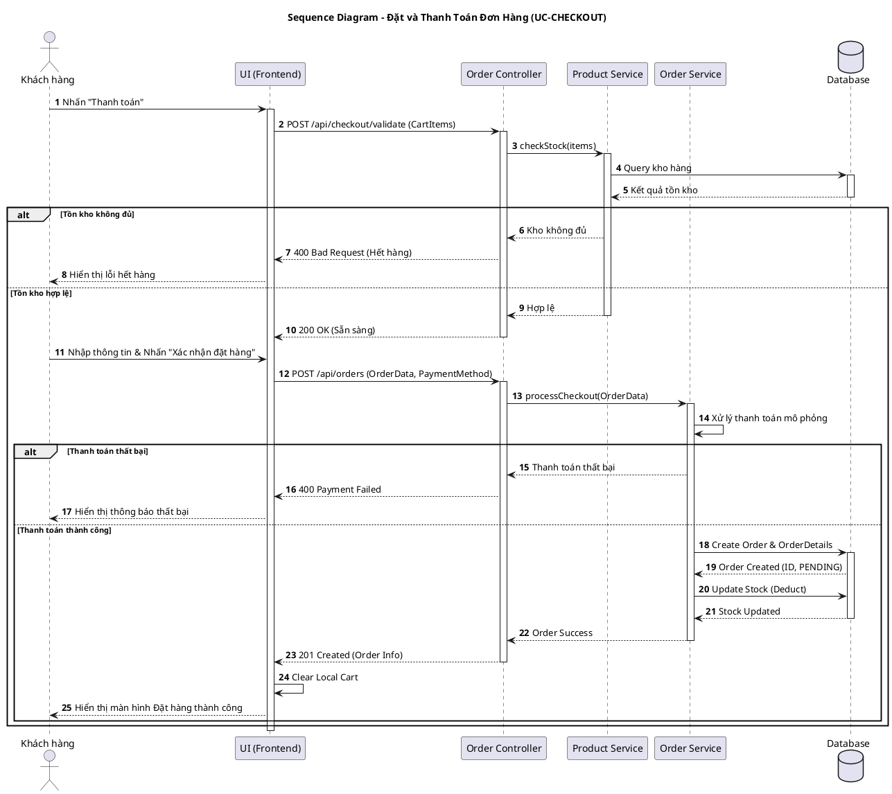

```plantuml
@startuml
title Sequence Diagram - Đặt và Thanh Toán Đơn Hàng (UC-CHECKOUT)

autonumber
actor "Khách hàng" as Customer
participant "UI (Frontend)" as UI
participant "Order Controller" as Controller
participant "Product Service" as ProductSvc
participant "Order Service" as OrderSvc
database "Database" as DB

Customer -> UI: Nhấn "Thanh toán"
activate UI

UI -> Controller: POST /api/checkout/validate (CartItems)
activate Controller
Controller -> ProductSvc: checkStock(items)
activate ProductSvc
ProductSvc -> DB: Query kho hàng
activate DB
DB --> ProductSvc: Kết quả tồn kho
deactivate DB

alt Tồn kho không đủ
    ProductSvc --> Controller: Kho không đủ
    Controller --> UI: 400 Bad Request (Hết hàng)
    UI --> Customer: Hiển thị lỗi hết hàng
else Tồn kho hợp lệ
    ProductSvc --> Controller: Hợp lệ
    deactivate ProductSvc
    Controller --> UI: 200 OK (Sẵn sàng)
    deactivate Controller

    Customer -> UI: Nhập thông tin & Nhấn "Xác nhận đặt hàng"
    UI -> Controller: POST /api/orders (OrderData, PaymentMethod)
    activate Controller
    
    Controller -> OrderSvc: processCheckout(OrderData)
    activate OrderSvc
    
    OrderSvc -> OrderSvc: Xử lý thanh toán mô phỏng
    alt Thanh toán thất bại
        OrderSvc --> Controller: Thanh toán thất bại
        Controller --> UI: 400 Payment Failed
        UI --> Customer: Hiển thị thông báo thất bại
    else Thanh toán thành công
        OrderSvc -> DB: Create Order & OrderDetails
        activate DB
        DB --> OrderSvc: Order Created (ID, PENDING)
        
        OrderSvc -> DB: Update Stock (Deduct)
        DB --> OrderSvc: Stock Updated
        deactivate DB
        
        OrderSvc --> Controller: Order Success
        deactivate OrderSvc
        
        Controller --> UI: 201 Created (Order Info)
        deactivate Controller
        
        UI -> UI: Clear Local Cart
        UI --> Customer: Hiển thị màn hình Đặt hàng thành công
    end
end
deactivate UI
@enduml
```