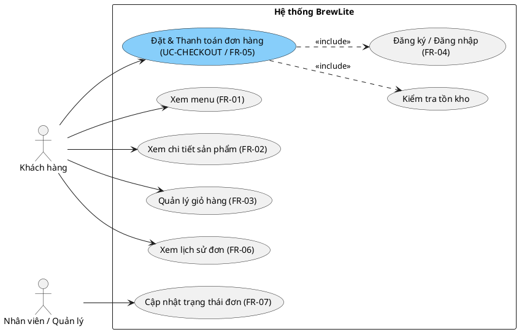

```plantuml
@startuml
left to right direction
skinparam packageStyle rectangle
skinparam actorStyle outline

actor "Khách hàng" as Customer
actor "Nhân viên / Quản lý" as Staff

rectangle "Hệ thống BrewLite" {
  
  usecase "Đặt & Thanh toán đơn hàng\n(UC-CHECKOUT / FR-05)" as UC_Checkout #LightSkyBlue
  usecase "Kiểm tra tồn kho" as UC_CheckStock
  usecase "Đăng ký / Đăng nhập\n(FR-04)" as UC_Auth
  
  usecase "Xem menu (FR-01)" as UC_Menu
  usecase "Xem chi tiết sản phẩm (FR-02)" as UC_Detail
  usecase "Quản lý giỏ hàng (FR-03)" as UC_Cart
  usecase "Xem lịch sử đơn (FR-06)" as UC_History
  usecase "Cập nhật trạng thái đơn (FR-07)" as UC_UpdateStatus
}

Customer --> UC_Menu
Customer --> UC_Detail
Customer --> UC_Cart
Customer --> UC_Checkout
Customer --> UC_History

UC_Checkout ..> UC_CheckStock : <<include>>
UC_Checkout ..> UC_Auth : <<include>>

Staff --> UC_UpdateStatus

@enduml
```