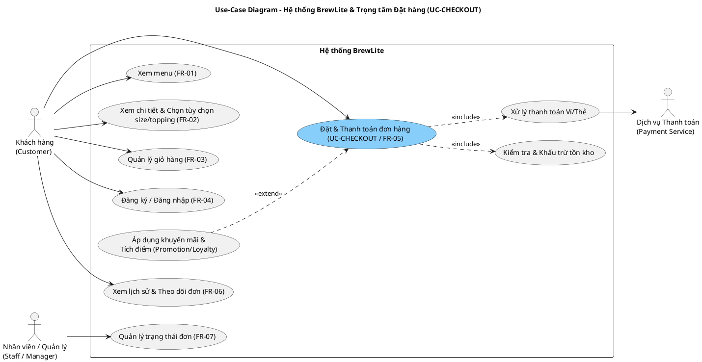

```plantuml
@startuml
title Use-Case Diagram - Hệ thống BrewLite & Trọng tâm Đặt hàng (UC-CHECKOUT)
left to right direction
skinparam packageStyle rectangle
skinparam actorStyle outline

actor "Khách hàng\n(Customer)" as Customer
actor "Nhân viên / Quản lý\n(Staff / Manager)" as Staff
actor "Dịch vụ Thanh toán\n(Payment Service)" as PaymentGateway

rectangle "Hệ thống BrewLite" {
  usecase "Xem menu (FR-01)" as UC_Menu
  usecase "Xem chi tiết & Chọn tùy chọn\nsize/topping (FR-02)" as UC_Detail
  usecase "Quản lý giỏ hàng (FR-03)" as UC_Cart
  usecase "Đăng ký / Đăng nhập (FR-04)" as UC_Auth
  
  ' Cụm Use-case trọng tâm (Task 1.3)
  usecase "Đặt & Thanh toán đơn hàng\n(UC-CHECKOUT / FR-05)" as UC_Checkout #LightSkyBlue
  usecase "Kiểm tra & Khấu trừ tồn kho" as UC_CheckStock
  usecase "Xử lý thanh toán Ví/Thẻ" as UC_ProcessPayment
  usecase "Áp dụng khuyến mãi &\nTích điểm (Promotion/Loyalty)" as UC_Promo
  
  usecase "Xem lịch sử & Theo dõi đơn (FR-06)" as UC_History
  usecase "Quản lý trạng thái đơn (FR-07)" as UC_UpdateStatus
}

Customer --> UC_Menu
Customer --> UC_Detail
Customer --> UC_Cart
Customer --> UC_Auth
Customer --> UC_Checkout
Customer --> UC_History

' Quan hệ trong phạm vi UC-CHECKOUT
UC_Checkout ..> UC_CheckStock : <<include>>
UC_Checkout ..> UC_ProcessPayment : <<include>>
UC_Promo ..> UC_Checkout : <<extend>>

' Liên kết với hệ thống thanh toán bên ngoài/mô phỏng
UC_ProcessPayment --> PaymentGateway

' Tác nhân Nhân viên/Quản lý
Staff --> UC_UpdateStatus
@enduml
```